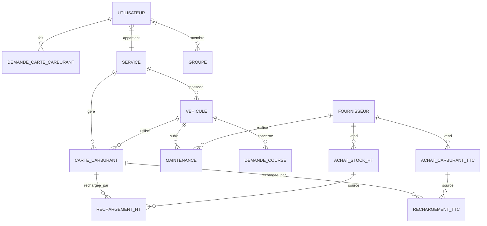
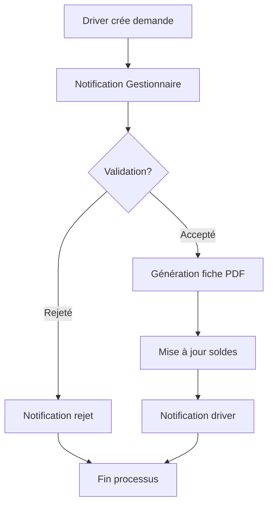
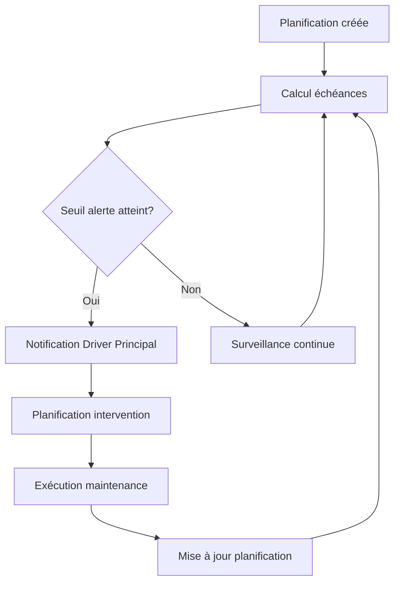
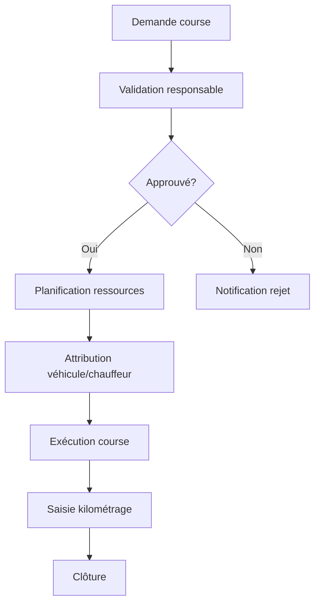

# FMS - Fleet Management System
## Documentation Technique Complète

---

## 1. Vue d'ensemble et Objectifs du Système

### 1.1 Présentation
FMS (Fleet Management System) est une application web moderne et complète développée pour le PNUD Côte d'Ivoire. Elle permet la gestion intégrale d'une flotte automobile incluant les véhicules, le carburant, la maintenance, les courses et l'administration.

### 1.2 Objectifs Principaux
- **Optimisation des coûts** : Suivi précis des dépenses de carburant et maintenance
- **Traçabilité complète** : Historique détaillé de toutes les opérations
- **Workflow automatisé** : Processus de validation et notifications automatiques
- **Reporting avancé** : Génération de rapports PDF et Excel
- **Interface moderne** : Design responsive compatible mobile/desktop

### 1.3 Utilisateurs Cibles
- **Administrateurs** : Gestion complète du système
- **Gestionnaires Carburant** : Validation des demandes et gestion des dotations
- **Drivers** : Demandes de carburant et courses
- **Driver Principal** : Planification et supervision des courses
- **Maintenance** : Suivi des interventions techniques

---

## 2. Architecture Technique

### 2.1 Stack Technologique
```
Backend:
- Django 4.2.19 (Framework Python)
- SQLite (Développement) / MySQL (Production)
- Python 3.8+

Frontend:
- Bootstrap 5
- HTML5, CSS3, JavaScript
- Templates Django
- Crispy Forms

Outils:
- xhtml2pdf (Génération PDF)
- xlsxwriter (Export Excel)
- Pillow (Traitement images)
```

### 2.2 Architecture Applicative
```
fms/
├── core/                    # Application principale
│   ├── models.py           # Modèles de données
│   ├── views.py            # Vues principales
│   ├── views_admin.py      # Vues administration
│   ├── views_execution_course.py # Vues courses
│   ├── forms.py            # Formulaires
│   ├── utils.py            # Utilitaires
│   ├── admin.py            # Interface admin Django
│   ├── urls.py             # Routes
│   ├── templates/          # Templates HTML
│   ├── static/             # Fichiers statiques
│   └── migrations/         # Migrations DB
├── fms/                     # Configuration projet
│   ├── settings.py         # Paramètres
│   ├── urls.py             # URLs principales
│   └── wsgi.py             # Configuration WSGI
├── media/                   # Fichiers uploadés
├── static/                  # Fichiers statiques collectés
└── manage.py               # Script de gestion Django
```

### 2.3 Configuration Base de Données
```python
# Développement
DATABASES = {
    'default': {
        'ENGINE': 'django.db.backends.sqlite3',
        'NAME': BASE_DIR / 'db.sqlite3',
    }
}

# Production (recommandé)
DATABASES = {
    'default': {
        'ENGINE': 'django.db.backends.mysql',
        'NAME': 'fms_db',
        'USER': 'fms_user',
        'PASSWORD': 'password',
        'HOST': 'localhost',
        'PORT': '3306',
    }
}
```

---

## 3. Modules et Fonctionnalités

### 3.1 Gestion des Utilisateurs
**Modèles :** `Utilisateur`, `Service`, `Groupe`

**Fonctionnalités :**
- Authentification personnalisée (email + mot de passe)
- Gestion des rôles et permissions
- Organisation par services et groupes
- Profils utilisateurs complets

**Rôles Principaux :**
- `Driver` : Demandes de carburant et courses
- `Gestionnaire Carburant` : Validation demandes carburant
- `Driver Principal` : Planification courses
- `Maintenance` : Gestion interventions
- `Admin` : Administration complète

### 3.2 Gestion de la Flotte
**Modèles :** `Vehicule`

**Fonctionnalités :**
- Inventaire complet des véhicules
- Suivi kilométrage en temps réel
- Gestion statuts (Disponible/Non Disponible)
- Documents et photos associés
- Historique complet des interventions

**Attributs Véhicule :**
```python
- Marque, Modèle, Châssis
- Immatriculation (unique)
- Type carburant (Essence/Gasoil)
- Date mise en service
- Kilométrage actuel
- Service d'affectation
```

### 3.3 Gestion du Carburant
**Modèles :** `Carte_Carburant`, `Achat_Stock_Carburant_HT`, `Achat_Carburant_TTC`, `Rechargement_Carte_Carburant_HT/TTC`, `Demande_Carte_Carburant`

**Workflow Carburant :**
1. **Achat de dotations** (HT ou TTC)
2. **Rechargement des cartes** depuis les dotations
3. **Demandes de carburant** par les drivers
4. **Validation** par les gestionnaires
5. **Génération fiches** de ravitaillement PDF
6. **Suivi consommation** et soldes

**Fonctionnalités Avancées :**
- Gestion dotations HT/TTC séparées
- Calcul automatique des soldes
- Alertes de seuils
- Rapports de consommation
- Export Excel des données

### 3.4 Gestion de la Maintenance
**Modèles :** `TypeMaintenance`, `Maintenance`, `Planification`

**Fonctionnalités :**
- Types de maintenance configurables
- Planification préventive (km + temps)
- Alertes automatiques d'échéance
- Suivi des coûts et fournisseurs
- Historique complet des interventions

**Système d'Alertes :**
```python
# Alerte kilométrique
km_alerte = prochaine_echeance_km - marge_alerte_km
if vehicule.kilometrage >= km_alerte:
    statut = "En alerte"

# Alerte temporelle
date_alerte = prochaine_echeance_date - marge_alerte_mois
if date_actuelle >= date_alerte:
    statut = "En alerte"
```

### 3.5 Gestion des Courses
**Modèles :** `DemandeCourse`, `PlanificationCourse`, `ExecutionCourse`

**Workflow Courses :**
1. **Demande** par utilisateur (lieu, date, objet)
2. **Validation** par responsable
3. **Planification** (attribution véhicule/chauffeur)
4. **Exécution** (suivi kilométrage réel)
5. **Clôture** avec remarques

**Statuts Demande :**
- `soumise` : En attente de traitement
- `acceptée` : Validée, en attente planification
- `rejetée` : Refusée avec justification
- `planifiée` : Programmée avec ressources
- `terminée` : Exécutée et clôturée

---

## 4. Modèles de Données et Relations

### 4.1 Diagramme Entité-Relation


### 4.2 Modèles Principaux

#### Utilisateur (Authentification personnalisée)
```python
class Utilisateur(AbstractBaseUser, PermissionsMixin):
    id_utilisateur = AutoField(primary_key=True)
    nom_complet = CharField(max_length=200)
    email = EmailField(unique=True)  # USERNAME_FIELD
    fonction = CharField(max_length=100)
    groupe = ManyToManyField(Groupe)
    service = ManyToManyField(Service)
    statut = CharField(choices=STATUT_CHOICES)
    is_active = BooleanField(default=True)
    is_staff = BooleanField(default=False)
```

#### Véhicule
```python
class Vehicule(models.Model):
    id_vehicule = AutoField(primary_key=True)
    service = ForeignKey(Service)
    marque = CharField(max_length=100)
    modele = CharField(max_length=100)
    chassis = CharField(max_length=100, unique=True)
    immatriculation = CharField(max_length=50, unique=True)
    type_carburant = CharField(choices=TYPE_CARBURANT_CHOICES)
    date_mise_en_service = DateField()
    kilometrage = PositiveIntegerField()
    statut = CharField(choices=STATUT_CHOICES)
```

#### Carte Carburant
```python
class Carte_Carburant(models.Model):
    id_carte_carburant = AutoField(primary_key=True)
    service = ForeignKey(Service)
    numero_carte = CharField(max_length=50, unique=True)
    solde = PositiveIntegerField(default=0)
    vehicule = ForeignKey(Vehicule, null=True, blank=True)
    statut = CharField(choices=STATUT_CHOICES)
    dotation_active_ht = ForeignKey('Achat_Stock_Carburant_HT')
    dotation_active_ttc = ForeignKey('Achat_Carburant_TTC')
```

---

## 5. Workflows et Processus Métier

### 5.1 Workflow Demande de Carburant


### 5.2 Workflow Maintenance Préventive


### 5.3 Workflow Course


---

## 6. Installation et Déploiement

### 6.1 Prérequis
```bash
# Système
Python 3.8+
pip (gestionnaire paquets)
Git

# Base de données (production)
MySQL 5.7+ ou PostgreSQL 10+

# Serveur web (production)
Nginx ou Apache
Gunicorn (WSGI)
```

### 6.2 Installation Développement
```bash
# 1. Cloner le projet
git clone <repository-url>
cd fms

# 2. Environnement virtuel
python -m venv venv
source venv/bin/activate  # Linux/Mac
venv\Scripts\activate     # Windows

# 3. Dépendances
pip install -r requirements.txt

# 4. Configuration base de données
python manage.py makemigrations
python manage.py migrate

# 5. Superutilisateur
python manage.py createsuperuser

# 6. Lancement
python manage.py runserver
```

### 6.3 Configuration Production
```python
# settings.py (production)
DEBUG = False
ALLOWED_HOSTS = ['votre-domaine.com', 'ip-serveur']

# Base de données MySQL
DATABASES = {
    'default': {
        'ENGINE': 'django.db.backends.mysql',
        'NAME': 'fms_production',
        'USER': 'fms_user',
        'PASSWORD': 'mot_de_passe_securise',
        'HOST': 'localhost',
        'PORT': '3306',
        'OPTIONS': {
            'charset': 'utf8mb4',
        },
    }
}

# Sécurité
SECURE_SSL_REDIRECT = True
SESSION_COOKIE_SECURE = True
CSRF_COOKIE_SECURE = True
```

### 6.4 Déploiement avec Gunicorn + Nginx
```bash
# 1. Installation Gunicorn
pip install gunicorn

# 2. Configuration Gunicorn
gunicorn --bind 0.0.0.0:8000 fms.wsgi:application

# 3. Configuration Nginx
server {
    listen 80;
    server_name votre-domaine.com;
    
    location / {
        proxy_pass http://127.0.0.1:8000;
        proxy_set_header Host $host;
        proxy_set_header X-Real-IP $remote_addr;
    }
    
    location /static/ {
        alias /path/to/fms/staticfiles/;
    }
    
    location /media/ {
        alias /path/to/fms/media/;
    }
}
```

---

## 7. Configuration et Paramètres

### 7.1 Variables d'Environnement
```python
# settings.py - Configuration email
EMAIL_BACKEND = 'django.core.mail.backends.smtp.EmailBackend'
EMAIL_HOST = 'mail.undpciv.org'
EMAIL_PORT = 465
EMAIL_USE_SSL = True
EMAIL_HOST_USER = 'fms@undpciv.org'
EMAIL_HOST_PASSWORD = 'password'
DEFAULT_FROM_EMAIL = 'FMS - Fleet Management System <fms@undpciv.org>'

# URL de base pour les liens
BASE_URL = 'http://votre-domaine.com'

# Authentification
LOGIN_URL = '/login/'
LOGIN_REDIRECT_URL = '/'
LOGOUT_REDIRECT_URL = '/login/'
AUTH_USER_MODEL = 'core.Utilisateur'
```

### 7.2 Logging
```python
LOGGING = {
    'version': 1,
    'disable_existing_loggers': False,
    'formatters': {
        'verbose': {
            'format': '{levelname} {asctime} {module} {message}',
            'style': '{',
        },
    },
    'handlers': {
        'file': {
            'level': 'DEBUG',
            'class': 'logging.FileHandler',
            'filename': 'debug.log',
            'formatter': 'verbose',
        },
    },
    'loggers': {
        'core': {
            'handlers': ['file'],
            'level': 'DEBUG',
            'propagate': True,
        },
    },
}
```

---

## 8. Sécurité et Authentification

### 8.1 Système d'Authentification
- **Modèle personnalisé** : `Utilisateur` hérite de `AbstractBaseUser`
- **Identifiant unique** : Email (au lieu du username)
- **Gestion des rôles** : Via groupes et permissions Django
- **Sessions sécurisées** : Configuration CSRF et cookies

### 8.2 Contrôles d'Accès
```python
# Décorateurs de sécurité
@login_required
@user_passes_test(lambda u: u.groupe.filter(nom_groupe='Gestionnaire Carburant').exists())
def demande_carte_carburant_traitement(request, pk):
    # Vue réservée aux gestionnaires carburant
    pass

# Mixins pour vues basées sur les classes
class MaintenanceCreateView(LoginRequiredMixin, CreateView):
    # Vue nécessitant une authentification
    pass
```

### 8.3 Validation des Données
```python
# Contraintes base de données
class Meta:
    constraints = [
        models.UniqueConstraint(
            fields=['achat_stock_carburant_ht', 'carte_carburant'],
            name='unique_ht_carte_rechargement'
        ),
        models.CheckConstraint(
            check=models.Q(dotation_active_ht__isnull=True) | 
                  models.Q(dotation_active_ttc__isnull=True),
            name='one_dotation_active_at_a_time'
        )
    ]

# Validation formulaires
class DemandeCarteCarburantCreateForm(forms.ModelForm):
    def clean_volume_demande(self):
        volume = self.cleaned_data['volume_demande']
        if volume <= 0:
            raise ValidationError("Le volume doit être positif")
        return volume
```

---

## 9. API et Intégrations

### 9.1 APIs Internes
```python
# API pour récupérer les cartes par dotation
path('api/cartes-by-dotation/', views.get_cartes_by_dotation)

# API kilométrage véhicule
path('api/vehicule/<int:id_vehicule>/kilometrage/', views.get_vehicule_kilometrage)

def get_cartes_by_dotation(request):
    dotation_type = request.GET.get('dotation_type')
    dotation_id = request.GET.get('dotation_id')
    
    if dotation_type == 'ht':
        cartes = Carte_Carburant.objects.filter(
            dotation_active_ht_id=dotation_id
        )
    else:
        cartes = Carte_Carburant.objects.filter(
            dotation_active_ttc_id=dotation_id
        )
    
    data = [{
        'id': carte.id_carte_carburant,
        'numero': carte.numero_carte,
        'solde': carte.get_solde_actif()
    } for carte in cartes]
    
    return JsonResponse({'cartes': data})
```

### 9.2 Notifications Email
```python
# Système de notifications automatiques
def notify_fuel_managers_new_request(demande):
    """Notifier les gestionnaires d'une nouvelle demande"""
    gestionnaires = Utilisateur.objects.filter(
        groupe__nom_groupe='Gestionnaire Carburant',
        is_active=True
    )
    
    subject = f"Nouvelle demande de carburant - {demande.vehicule}"
    message = render_to_string('emails/nouvelle_demande.html', {
        'demande': demande,
        'base_url': settings.BASE_URL
    })
    
    for gestionnaire in gestionnaires:
        send_mail(
            subject=subject,
            message=strip_tags(message),
            html_message=message,
            from_email=settings.DEFAULT_FROM_EMAIL,
            recipient_list=[gestionnaire.email]
        )
```

### 9.3 Génération de Rapports
```python
# Export PDF avec xhtml2pdf
def generer_fiche_ravitaillement(demande):
    template = get_template('core/fiche_ravitaillement.html')
    context = {
        'demande': demande,
        'date_generation': timezone.now()
    }
    
    html = template.render(context)
    pdf_file = BytesIO()
    pisa.CreatePDF(html, dest=pdf_file)
    
    return pdf_file

# Export Excel avec xlsxwriter
def export_maintenance_excel(maintenances):
    output = BytesIO()
    workbook = xlsxwriter.Workbook(output)
    worksheet = workbook.add_worksheet('Maintenances')
    
    # Headers
    headers = ['Date', 'Véhicule', 'Type', 'Montant', 'Fournisseur']
    for col, header in enumerate(headers):
        worksheet.write(0, col, header)
    
    # Data
    for row, maintenance in enumerate(maintenances, 1):
        worksheet.write(row, 0, maintenance.date.strftime('%d/%m/%Y'))
        worksheet.write(row, 1, str(maintenance.vehicule))
        worksheet.write(row, 2, maintenance.type_maintenance.libelle)
        worksheet.write(row, 3, maintenance.montant)
        worksheet.write(row, 4, maintenance.fournisseur.nom_fournisseur)
    
    workbook.close()
    return output
```

---

## 10. Maintenance et Évolutions

### 10.1 Structure des Tests
```python
# tests.py
class VehiculeModelTest(TestCase):
    def setUp(self):
        self.service = Service.objects.create(nom_service="Test Service")
        
    def test_vehicule_creation(self):
        vehicule = Vehicule.objects.create(
            service=self.service,
            marque="Toyota",
            modele="Corolla",
            chassis="TEST123",
            immatriculation="AB-123-CD",
            type_carburant="Essence",
            date_mise_en_service=date.today(),
            kilometrage=50000
        )
        self.assertEqual(str(vehicule), "Toyota Corolla - AB-123-CD")
```

### 10.2 Scripts de Maintenance
```python
# management/commands/update_planifications.py
from django.core.management.base import BaseCommand
from core.models import Planification, Maintenance

class Command(BaseCommand):
    help = 'Met à jour les planifications après maintenance'
    
    def handle(self, *args, **options):
        # Logique de mise à jour automatique
        planifications = Planification.objects.filter(
            vehicule__maintenances__date__gte=timezone.now().date()
        )
        
        for planification in planifications:
            # Recalculer les échéances
            planification.save()
            
        self.stdout.write(
            self.style.SUCCESS(
                f'Mis à jour {planifications.count()} planifications'
            )
        )
```

### 10.3 Monitoring et Logs
```python
# Logs personnalisés
import logging
logger = logging.getLogger('core')

def demande_carte_carburant_create(request):
    try:
        # Logique de création
        logger.info(f"Nouvelle demande créée par {request.user.email}")
    except Exception as e:
        logger.error(f"Erreur création demande: {str(e)}")
        raise
```

---

## 11. Performances et Optimisation

### 11.1 Optimisations Base de Données
```python
# Indexes pour performances
class Meta:
    indexes = [
        models.Index(fields=['date_creation']),
        models.Index(fields=['statut', 'service']),
        models.Index(fields=['vehicule', 'date_demande'])
    ]

# Requêtes optimisées
def get_demandes_with_relations():
    return Demande_Carte_Carburant.objects.select_related(
        'utilisateur', 'vehicule', 'service'
    ).prefetch_related(
        'vehicule__cartes_carburant'
    )
```

### 11.2 Cache et Sessions
```python
# Configuration cache
CACHES = {
    'default': {
        'BACKEND': 'django.core.cache.backends.redis.RedisCache',
        'LOCATION': 'redis://127.0.0.1:6379/1',
    }
}

# Cache de vues
from django.views.decorators.cache import cache_page

@cache_page(60 * 15)  # Cache 15 minutes
def dashboard_carburant(request):
    # Vue avec données statistiques
    pass
```

---

## 12. Conclusion

FMS est un système complet et robuste qui répond aux besoins complexes de gestion de flotte automobile. Son architecture modulaire Django permet une maintenance aisée et des évolutions futures. La documentation technique fournie permet une compréhension approfondie du système pour faciliter le développement, la maintenance et les évolutions futures.

### Points Forts
- Architecture Django robuste et scalable
- Modèles de données bien structurés
- Workflows métier automatisés
- Interface utilisateur moderne et responsive
- Système de notifications intégré
- Rapports et exports avancés
- Sécurité et authentification complètes

### Évolutions Possibles
- API REST complète
- Application mobile native
- Intégration GPS/télématique
- Tableau de bord temps réel
- Intelligence artificielle pour prédictions
- Intégration systèmes comptables

---

**© 2025 PNUD Côte d'Ivoire - Tous droits réservés**